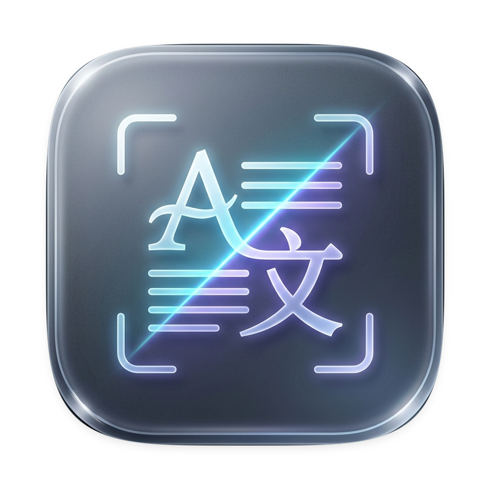

<!-- prettier-ignore -->
<div align="center">



# Capture2Text Next

*Snippet any text on screen, translate it instantly, and hear it out loud.*

[](https://tauri.app)
[](https://www.rust-lang.org)
[](https://www.typescriptlang.org)
[](https://vite.dev)
[](https://bun.sh)
[](https://tesseract.projectnaptha.com)

[](https://github.com/HaoNgo232/capture2text-next/releases/latest)
[](https://github.com/HaoNgo232/capture2text-next/actions/workflows/ci.yml)
[](LICENSE)

:star: If you like this project, star it on GitHub — it helps a lot!

[Download and install](#download-and-install) • [Screenshots](#screenshots) • [Features](#features) • [How it works](#how-it-works) • [Prerequisites](#prerequisites) • [Getting started](#getting-started) • [Usage](#usage) • [Keyboard shortcuts](#keyboard-shortcuts) • [Configuration](#configuration) • [Project structure](#project-structure) • [Development notes](#development-notes) • [Troubleshooting](#troubleshooting) • [Contributing](#contributing) • [Roadmap](#roadmap) • [Acknowledgments](#acknowledgments) • [License](#license)

</div>

A lightweight desktop snipping translator for Windows, built with [Tauri 2](https://tauri.app) and a vanilla TypeScript frontend. Hit a global hotkey, drag over any text on screen, and Capture2Text Next recognizes it locally with [tesseract.js](https://tesseract.projectnaptha.com), translates it through Google Translate or a Groq-hosted LLM, copies the result to your clipboard and can read it back to you.

The app lives in the system tray and keeps working while hidden, so capture-and-translate is always one keypress away — even from a full-screen app.

> [!NOTE]
> The current build targets **Windows 10/11**. Screen capture, clipboard access, synthetic `Ctrl+C` for quick translate and auto-start are implemented with Win32 APIs and the `HKCU\...\Run` registry key.

> [!NOTE]
> The interface ships in **Vietnamese and English**. The labels quoted throughout this README — `Cấu hình` (settings), `Văn bản gốc` (source), `Bản dịch` (result), `Dịch` (translate), `Phát âm` (read aloud) — are the Vietnamese strings you will see in the app. Switch to English in **Settings → UI Language**.

## Download and install

Grab the installer from the [latest release](https://github.com/HaoNgo232/capture2text-next/releases/latest) — nothing else needs to be installed first:

| File | Notes |
| --- | --- |
| `*_x64-setup.exe` | NSIS installer. Recommended, and the quickest way in. |
| `*_x64_en-US.msi` | Windows Installer package, for scripted or managed installs. |

> [!IMPORTANT]
> The bundles are **not code signed**, so SmartScreen shows *"Windows protected your PC"* the first time you run the installer. Choose **More info** → **Run anyway**. Code signing is on the [roadmap](#roadmap).

Releases are packaged by [`.github/workflows/release.yml`](.github/workflows/release.yml) on every `v*` tag, so the newest download is always the newest build. To compile it yourself instead, jump to [Getting started](#getting-started).

## Screenshots

<!-- Nothing is committed yet. To publish screenshots:
     1. Save PNG captures as docs/screenshots/translate-view.png, docs/screenshots/snipping-overlay.png and docs/screenshots/settings.png
     2. Delete this comment block and the comment markers around the table below. -->
<!--
| Translate view | Snipping overlay | Settings |
| --- | --- | --- |
|  |  |  |
-->

No screenshots are committed yet, so `app-icon.png` at the top of this file is currently the only preview of what the app looks like. In the meantime, [Usage](#usage) walks through both capture flows step by step.

## Features

- **Frozen-screen snipping** - the desktop is captured before the overlay appears, so there is no flicker or black frame. The overlay shows a dimmed freeze-frame with a live selection rectangle, a dimensions badge and `Esc` to cancel.
- **Lossless crop** - the full-resolution RGBA frame is cached in Rust memory; the selected region is cropped natively and handed to OCR as a pixel-perfect PNG.
- **Local OCR** - tesseract.js runs inside the WebView with adaptive contrast stretching (Rec. 601 luminance) and automatic 2x upscaling for tiny snippets. Japanese, English, Vietnamese and Simplified Chinese are available in the language picker.
- **Language-aware text cleanup** - CJK output is stripped of stray whitespace and line breaks, Latin output has line breaks collapsed, and curly quotes are normalized to ASCII.
- **Two translation engines** - free Google Translate (no API key needed) or Groq LLM models, with the model list fetched live from your own account. If the Groq key is missing, the app offers to fall back to Google.
- **Translation latency readout** - every request reports its round-trip time next to the translate button.
- **Quick translate selected text** - `Alt+T` synthesizes `Ctrl+C` on the focused app, grabs the selection and translates it without any OCR.
- **Read aloud** - the frontend speech player splits the text into sentence-aware 150-character chunks and the Rust backend proxies each one to Google TTS, returning Base64 audio; if that fails, playback falls back to the OS Web Speech voices.
- **System tray first** - left click shows and focuses the window (it always raises it, it does not toggle), right click opens a menu with *Open UI*, *Capture screen (OCR)*, *Quick translate* and *Quit*. Closing the window hides it instead of quitting.
- **Windows auto-start** - opt-in auto start that registers `capture2text-next.exe --silent`, so the app boots straight into the tray.
- **Clipboard image paste** - `Ctrl+V` pastes a screenshot from the clipboard straight into OCR.
- **Persisted settings** - provider, model, OCR language, shortcuts, toggles and the API key are stored locally in `localStorage` under `capture2text_*` keys.

## How it works

```
┌──────────────────────────────────────────────────────────────────────────────────────────────┐
│   Frontend - Vite + vanilla TypeScript                                                       │
│                                                                                              │
│   src/main.ts            view switching, settings form, snipping overlay, clipboard handlers │
│   modules/config         ConfigStore         typed, schema-driven localStorage settings      │
│   modules/ocr            OcrPipeline         tesseract.js + preprocessing + text cleanup     │
│   modules/translation    TranslationService  Google / Groq adapters with automatic fallback  │
│   modules/speech         NaturalSpeechPlayer chunked TTS playback + Web Speech fallback      │
│   modules/shortcuts      ShortcutManager     parse, normalize, validate, render shortcuts    │
└──────────────────────────────────────────────────────────────────────────────────────────────┘
                                                │  Tauri IPC (invoke / listen)
                                                ▼
┌──────────────────────────────────────────────────────────────────────────────────────────────┐
│   Rust backend - src-tauri/src/lib.rs                                                        │
│                                                                                              │
│   capture_screen / crop_captured_screen       xcap capture, in-memory frame cache, crop      │
│   capture_region                              direct capture + crop in one call              │
│   register_trigger_shortcut / register_quick_translate_shortcut     hotkey registration      │
│   get_selected_text                           Win32 clipboard read + synthetic Ctrl+C        │
│   synthesize_speech                           Google TTS proxy as a Base64 data URL          │
│   is_silent_start / is_autostart_enabled / set_autostart   Run key auto start                │
│   enter_snipping / exit_snipping / show_main_window / hide_main_window                       │
│   tray icon, tray menu and close-to-tray window lifecycle                                    │
└──────────────────────────────────────────────────────────────────────────────────────────────┘
```

A capture round trip:

1. `Alt+Q` fires the global shortcut handler in Rust and emits `trigger-capture` to the window.
2. The window is hidden, the primary monitor is captured with `xcap`, the full-resolution RGBA frame is cached in a Rust `Mutex`, and a fast JPEG copy is returned for the overlay.
3. The window goes fullscreen and always-on-top; the frontend paints the freeze-frame, dims it and tracks the drag selection on a canvas.
4. On mouse-up the overlay closes and the exact pixel region is cropped from the cached Rust frame, returning a lossless PNG data URL.
5. The crop is upscaled and contrast-stretched if needed, recognized by tesseract.js with live progress, then cleaned according to the source language.
6. If auto-translate is on, the translated text lands in the result pane, is copied to the clipboard and the window is shown.

## Prerequisites

- **Windows 10/11 (x64)**.
- **[Bun](https://bun.sh) >= 1.3** - package manager and test runner used by this project.
- **Rust stable toolchain** with the MSVC target - install via [rustup](https://rustup.rs).
- **Microsoft C++ Build Tools** (Desktop development with C++ workload) and the **WebView2 runtime** (preinstalled on Windows 10/11). See the [Tauri prerequisites guide](https://tauri.app/start/prerequisites/).
- **An internet connection** on first use: OCR language data is downloaded on demand and the translation/TTS endpoints are called over HTTPS.

> [!TIP]
> No API key is required to try the app. Google Translate and Google TTS are used without credentials by default.

## Getting started

```bash
git clone https://github.com/HaoNgo232/capture2text-next.git
cd capture2text-next

# Install frontend dependencies
bun install

# Run the app in development mode (starts Vite + the Tauri shell)
bun run tauri dev
```

The first `tauri dev` run compiles the Rust backend and can take a few minutes. Because the app is tray-first, look for the tray icon if no window appears.

### Build a release bundle

```bash
bun run tauri build
```

Installers are written to:

- `src-tauri/target/release/bundle/msi/capture2text-next_0.1.0_x64_en-US.msi`
- `src-tauri/target/release/bundle/nsis/capture2text-next_0.1.0_x64-setup.exe`

CI builds both and attaches them to a GitHub Release whenever a `v*` tag is pushed — see [`.github/workflows/release.yml`](.github/workflows/release.yml).

### Run the tests

```bash
bun test
```

The suite covers the config store, shortcut parsing and validation, OCR text cleanup, TTS chunking and playback sequencing, and both translation adapters.

## Usage

**Snippet and translate**

1. Press `Alt+Q` (configurable) from any application.
2. Drag a rectangle over the text you want — the selection is highlighted on the frozen desktop.
3. OCR runs with a progress bar, the translation appears in the result pane and is copied to the clipboard automatically.
4. Press `Esc` at any time during selection to cancel.

**Translate already-selected text**

1. Select text in any application, then press `Alt+T` (configurable).
2. The app sends `Ctrl+C`, reads the clipboard and translates the selection — no screenshot involved.

**Type or paste instead**

- Type or paste text into the *Văn bản gốc* (source) box and click **Dịch**, or press `Ctrl+Enter` inside the box.
- Press `Ctrl+V` anywhere in the window to run OCR on an image already in the clipboard.

**Playback**

- **Phát âm** speaks the source text using the OCR language, or the translation using the target language. Click again to stop.

**Tray**

- **Chạy ngầm** hides the window, and closing the window hides it as well.
- Left click the tray icon to show the window; right click for *Open UI*, *Capture screen (OCR)*, *Quick translate* and *Quit*.

## Keyboard shortcuts

| Shortcut | Where | Action |
| --- | --- | --- |
| `Alt+Q` | Global (configurable) | Snippet a screen region, OCR and translate |
| `Alt+T` | Global (configurable) | Translate the text currently selected in the focused app |
| `Ctrl+V` | App window | Run OCR on an image from the clipboard |
| `Ctrl+Enter` | Source text box | Translate the current text |
| `Esc` | Snipping overlay | Cancel the selection |
| `Esc` | Shortcut recorder | Stop recording |

Settings offer the presets `Alt+Q`, `Ctrl+Shift+S`, `Ctrl+Shift+Q`, `Alt+D` and `F4`, or you can record any custom combination. Function keys work standalone; other keys need at least one modifier.

## Configuration

Open **Cấu hình** from the header. Provider, OCR language and target language also sit on the main control strip and are saved as soon as you change them.

| Setting | Notes |
| --- | --- |
| Source language (`Ngôn ngữ nhận diện`) | The OCR model: `jpn` (default), `eng`, `vie`, `chi_sim`. It also picks the voice used by *Phát âm* in the source pane. |
| Target language (`Ngôn ngữ dịch sang`) | `vi` (default), `en`, `ja`, `zh-CN`, `de`, `fr`. Drives the translation and the voice used by *Phát âm* in the result pane. |
| Groq API Key | Create one at [console.groq.com/keys](https://console.groq.com/keys). Only needed for the Groq engine. |
| Global shortcut | Preset list or **Ghi phím** to record a combination; it is re-registered immediately on save. |
| AI model | **Tải danh sách model** calls `GET https://api.groq.com/openai/v1/models` with your key and lists active chat models (Whisper, guard and embedding models are filtered out). The result is cached in `localStorage` under `capture2text_groq_cached_models`. |
| Quick translate shortcut | Recorded the same way; clear it to disable the feature. |
| Auto translate after OCR | Runs the translation as soon as text is recognized. |
| Translation-only display | Hides the source text box and shows only the translation result. |
| Silent startup | Launches hidden in the tray without showing the window. |
| Image preview | Shows the preprocessed snippet above the source box. |
| Auto startup with Windows | Writes `"<path>\capture2text-next.exe" --silent` to `HKCU\Software\Microsoft\Windows\CurrentVersion\Run` under the value name `Capture2TextNext`. |

> [!WARNING]
> The Groq API key is stored unencrypted in the WebView `localStorage` on your own machine. It is only ever sent to `api.groq.com`, but treat it as a local secret and rotate it if you share your machine profile.

To reset the app, clear its `capture2text_*` `localStorage` entries; to remove auto-start, delete the `Capture2TextNext` value from the Windows Run registry key.

## Project structure

```
.
├── AGENTS.md                           Commands and conventions for AI coding agents
├── .github/workflows                   CI (type check and tests) plus release packaging
├── index.html                          Single-window UI (source pane, result pane, settings, shortcuts, snipping overlay)
├── src
│   ├── main.ts                         Wire-up: views, settings form, snipping overlay, clipboard and speech actions
│   ├── styles.css                      Translucent card layout and overlay styling
│   ├── i18n
│   │   ├── index.ts                        createI18n() factory, Lang type, I18n interface
│   │   ├── vi.ts                           Vietnamese translations
│   │   └── en.ts                           English translations
│   └── modules
│       ├── config/configStore.ts           Typed settings schema over localStorage
│       ├── ocr/ocrPipeline.ts              tesseract.js recognition with progress events
│       ├── ocr/imagePreprocessor.ts        Rec. 601 grayscale + adaptive contrast stretch, small-snippet upscale
│       ├── ocr/textCleaner.ts              Language-aware whitespace and quote normalization
│       ├── translation/                    Service plus Google/Groq adapters and shared types
│       ├── speech/speechPlayer.ts          TTS chunking, sequential playback, Web Speech fallback
│       └── shortcuts/shortcutManager.ts    Parse, validate, normalize and render shortcuts
├── src-tauri
│   ├── src/lib.rs                      All Rust commands, tray icon and app lifecycle
│   ├── src/main.rs                     Binary entry point
│   ├── capabilities/default.json       Tauri v2 permission set for the main window
│   └── tauri.conf.json                 Window, bundle and build configuration
├── tests                               Bun test suites for the frontend modules
└── docs/screenshots                    Screenshots for this README (empty until captures are added)
```

## Development notes

- **Bun is the package manager.** `tauri.conf.json` runs `bun run dev` / `bun run build` as before-commands, so keep Bun installed even if you use another manager for ad-hoc scripts.
- **Frontend only:** `bun run dev` serves the UI at `http://localhost:1420` (fixed port, strict). Tauri commands are unavailable in a plain browser, so capture, tray and speech actions report errors there.
- **Type checking:** `bun run build` runs `tsc` (strict, with `noUnusedLocals` and `noUnusedParameters`) before bundling with Vite, so type errors fail the build.
- **Testable by design:** each frontend module takes its dependencies (storage, `fetch`, tesseract, audio factory) as constructor options, which is what lets `bun test` cover them without a DOM.
- **The window starts hidden** (`"visible": false` in `tauri.conf.json`) and is shown by the frontend after settings load, unless silent start applies.

## Troubleshooting

**OCR is slow, or reports the OCR library is not ready on the first capture**

tesseract.js downloads the `*.traineddata` file for the selected language from the jsDelivr CDN the first time that language is used, then caches it. The first run therefore needs network access and takes noticeably longer; later runs are fast.

**OCR returns little or no text**

Select a tighter region around the text, prefer high-contrast content, and pick the correct source language in the control strip. Snippets smaller than 35 px are upscaled 2x automatically, but heavily compressed or rotated text will still fail.

**A global shortcut does nothing**

Another application is probably holding `Alt+Q` or `Alt+T`. Record a different combination in **Cấu hình**. A failed registration keeps the previous shortcut, so the app never becomes unreachable.

**Quick translate (`Alt+T`) picks up nothing**

The feature simulates `Ctrl+C` with Win32 `keybd_event`, which cannot reach an elevated (run-as-administrator) app from a non-elevated process, and some terminals or games ignore synthetic input. Copy the text manually and paste it into the source box instead.

**The captured region is black or blank**

Protected/DRM video surfaces and some GPU-accelerated layers cannot be captured. The overlay also freezes the desktop, so content that changes after the overlay appears is not in the crop — press the shortcut again to re-capture.

**No window appears after launching**

The app is tray-first. Check the tray icon, and note that *Silent startup* and auto-start with `--silent` intentionally launch without showing the window.

**Only the primary monitor is captured**

Screen capture targets the primary display, so on multi-monitor setups the snipping overlay covers the primary monitor only.

**The app window is missing from my screenshot**

That is intentional: the window is hidden just before capturing so it never appears in the crop.

## Contributing

Issues and pull requests are welcome. There is no build magic to learn — install, test, run:

```bash
bun install          # frontend dependencies
bun test             # unit tests; no DOM and no network required
bun run tauri dev    # the full app, Rust backend included
```

A few conventions are worth knowing before you open a pull request:

- **Keep modules testable by injection.** Everything in `src/modules` takes its collaborators (storage, `fetch`, tesseract, the audio factory) as constructor options. That is what lets `bun test` cover them without a DOM, so new logic should keep the same shape.
- **Pair every behavior change with a test.** The suites in `tests/` mirror the modules in `src/modules` one for one.
- **`bun run build` has to pass.** It runs `tsc` in strict mode with `noUnusedLocals` and `noUnusedParameters` before Vite bundles, so a single unused local fails the build.
- **Rust commands live in `src-tauri/src/lib.rs`.** Register new ones in the `generate_handler!` macro and add the matching wrapper in the frontend.
- **Match the surrounding style.** Vanilla TypeScript with no UI framework, Vietnamese UI strings, English code comments.

CI runs `bun run build`, `bun test` and `cargo check` on every push and pull request ([`.github/workflows/ci.yml`](.github/workflows/ci.yml)), so a red check is the first thing to look at.

### Reporting a bug

Include your Windows version, the OCR language, the translation engine in use and the exact message shown in the app. For capture problems, say whether the app was launched normally or with `--silent`, because that changes what the window does at startup.

## Roadmap

Direction, not commitments — no dates and nothing promised:

- [x] **Localize the interface.** Vietnamese and English are supported; switch in Settings → UI Language.
- [ ] **Multi-monitor snipping.** Capture currently targets the primary display only (see [Troubleshooting](#troubleshooting)).
- [ ] **Bundle the OCR language data.** `*.traineddata` files are fetched from the jsDelivr CDN on first use, which makes the first capture of each language slow and offline-unfriendly.
- [ ] **Cross-platform builds.** Screen capture, synthetic `Ctrl+C` and auto-start are Win32 and registry specific, so macOS and Linux would each need their own implementation.
- [ ] **Code sign the installers.** Releases are unsigned, so SmartScreen warns on first launch.

## Acknowledgments

- **[Capture2Text](https://capture2text.sourceforge.net/)** by Warren Galyen — the original Windows snip-and-OCR utility this project is named after. If you want classic local OCR without translation, start there.
- **[Tauri](https://tauri.app)** — the desktop shell, tray icon, global shortcuts and IPC. The frontend was scaffolded from the `create-tauri-app` vanilla-TypeScript template.
- **[tesseract.js](https://tesseract.projectnaptha.com)** — local OCR inside the WebView, with language data served from jsDelivr.
- **[xcap](https://github.com/nashaofu/xcap)** — screen capture used by the Rust backend.
- **[Groq](https://groq.com)** — the optional LLM translation engine. Google Translate and Google TTS are called through their public, unauthenticated endpoints.
- **[Bun](https://bun.sh)** — package manager and test runner.

## License

Licensed under the [Apache License, Version 2.0](LICENSE).
