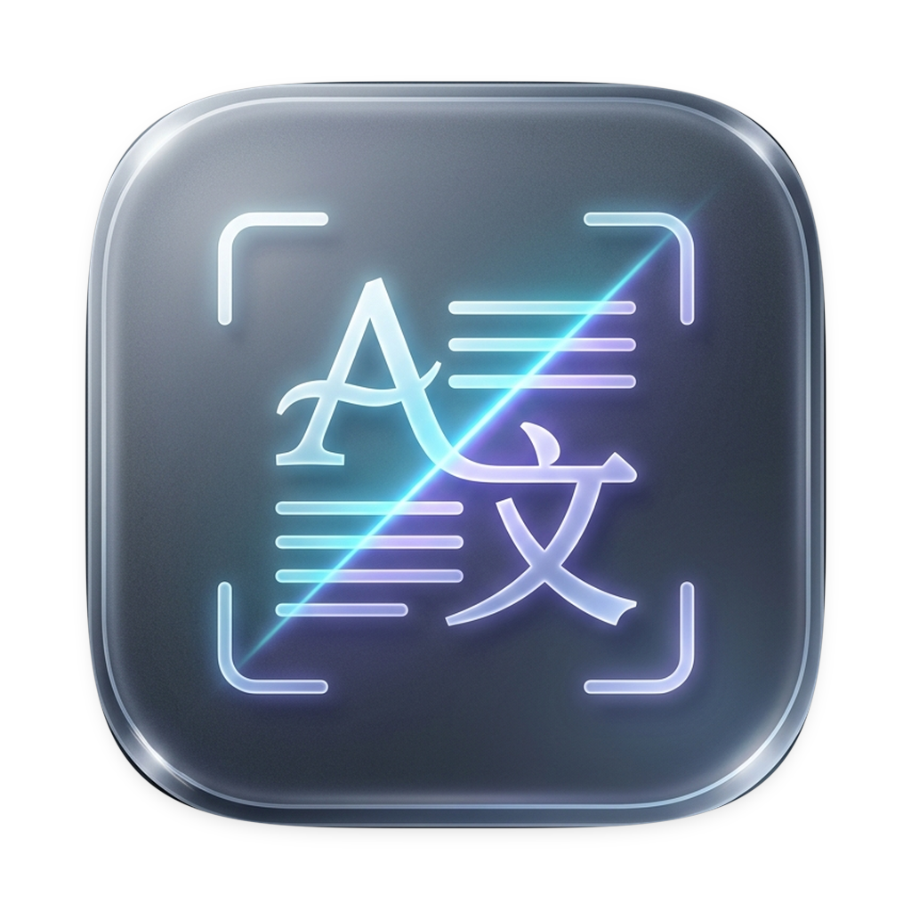

<!-- prettier-ignore -->
<div align="center">



# Capture2Text Next

A lightweight Windows tray utility for instant screen OCR, text translation, and speech playback.

[](https://github.com/HaoNgo232/capture2text-next/releases/latest)
[](https://github.com/HaoNgo232/capture2text-next/actions/workflows/ci.yml)
[](https://microsoft.com/windows)
[](LICENSE)

</div>

Most desktop translation tools force an unnecessary trade-off: either clunky legacy Win32 utilities with brittle hotkey handling, or bloated 400MB Electron apps idling in the background just to copy clipboard text.

**Capture2Text Next** is a fast, minimal (~50MB RAM) desktop companion built with [Tauri 2](https://tauri.app), Rust, and vanilla TypeScript. It sits quietly in the system tray, freezes the screen on hotkey, recognizes text locally with [tesseract.js](https://tesseract.projectnaptha.com), translates via Google Translate or Groq LLMs, copies the result directly to your clipboard, and can read it aloud.

> [!NOTE]
> **Windows-only build**: Relies on Win32 APIs for screen capture, clipboard inspection, synthetic input (`Ctrl+C`), and registry autostart (`HKCU\...\Run`).
> The UI supports **Vietnamese and English** (toggle under **Settings → UI Language**).

---

## Download & Install

Grab the installer from the [latest release](https://github.com/HaoNgo232/capture2text-next/releases/latest):

| Package | Use Case |
| --- | --- |
| `capture2text-next_*_x64-setup.exe` | Standard NSIS installer (recommended). |
| `capture2text-next_*_x64_en-US.msi` | Windows Installer package for managed deployments. |

> [!IMPORTANT]
> **SmartScreen Warning**: Releases are currently unsigned. On first launch, Windows SmartScreen will display *"Windows protected your PC"*. Click **More info** ➔ **Run anyway**.

---

## Core Workflows

### 1. Snippet OCR & Translate (`Alt+Q`)
1. Press `Alt+Q` from any application or game.
2. The desktop freezes instantly (zero black flicker). Drag a selection box over the text.
3. The app crops the region at native display resolution, runs local OCR, translates the text, copies the output to your clipboard, and reveals the window.
4. Hit `Esc` at any point during selection to cancel without side effects.

### 2. Quick Translate Highlighted Text (`Alt+T`)
1. Highlight any text in your browser, terminal, or document.
2. Press `Alt+T`.
3. The app synthesizes a native `Ctrl+C` into the active window, reads the clipboard text directly, and translates it immediately — skipping the OCR pipeline entirely (0ms capture latency).

### 3. Direct Input & Image Paste
- **Type or paste**: Paste or edit text in the source box. Translation triggers automatically with a 500ms debounce, or immediately on `Ctrl+Enter`.
- **Clipboard image paste (`Ctrl+V`)**: Hit `Ctrl+V` inside the window to feed an existing clipboard screenshot directly into the OCR engine.
- **Natural speech playback**: Click **Phát âm** / **Read Aloud** to stream sentence-chunked TTS via Google TTS (with fallback to the OS Web Speech API).

---

## How It Works (The Mechanics)

```
[ User triggers Alt+Q ]
        │
        ▼
[ Rust Backend (xcap) ] ──────────────► Captures primary monitor frame
        │                                Caches raw RGBA in Mutex
        ▼
[ Transparent Fullscreen Window ] ────► Renders dimmed freeze-frame on canvas
        │                                Tracks user drag selection (Esc to cancel)
        ▼
[ Rust crop_captured_screen ] ────────► Lossless pixel crop from raw RGBA buffer
        │                                Emits high-res PNG data URL
        ▼
[ Frontend Preprocessing ] ───────────► Rec. 601 grayscale contrast stretch
        │                                2x upscaling if dimensions < 35px
        ▼
[ Web Worker (tesseract.js) ] ────────► Local OCR recognition (cached traineddata)
        │
        ▼
[ Text Sanitizer ] ───────────────────► CJK: strips broken linebreaks & spaces
        │                                Latin: collapses whitespace, normalizes quotes
        ▼
[ Translation Engine ] ───────────────► Google Translate (zero config) or
        │                                Groq LLM (custom model list via API key)
        ▼
[ Result Action ] ────────────────────► Writes to clipboard + optional TTS readout
```

### Architectural Decisions & Trade-Offs

- **Screen freeze before overlay**: Many screen capture tools show a brief flicker or cursor jump when showing the overlay. Capture2Text Next takes the screen capture with `xcap` *before* making the fullscreen window visible, guaranteeing zero visual tearing.
- **Lossless in-memory buffer**: The raw screen frame is retained in Rust memory inside a `Mutex`. When you drag an area, Rust crops the original raw pixels instead of stretching a downscaled Web canvas image.
- **Local OCR via WebView2**: OCR runs inside a browser Web Worker using `tesseract.js`. This eliminates heavy native C++ Tesseract binary dependencies in the installer while isolating OCR compute from the UI thread.
- **First-run download cost**: Language models (`*.traineddata`) are fetched on demand from the jsDelivr CDN on the very first capture of a language, then cached locally in IndexedDB. First run takes a couple of seconds over the network; subsequent runs are local and offline.
- **Debounced live translation**: Direct input in the source box uses a 500ms debounce timer to prevent hammering the translation endpoint on every keystroke.

---

## Keyboard Shortcuts

| Shortcut | Scope | Action |
| --- | --- | --- |
| `Alt+Q` | Global | Freeze desktop, snip region, OCR and translate. |
| `Alt+T` | Global | Copy active selection via synthetic `Ctrl+C` and translate. |
| `Ctrl+V` | App Window | Run OCR on an image from the clipboard. |
| `Ctrl+Enter`| Source Textarea | Trigger instant translation. |
| `Esc` | Overlay / Recorder | Cancel active selection or stop shortcut recording. |

Custom shortcuts can be recorded in **Settings** (`Cấu hình`). Function keys (`F1`–`F12`) work standalone; standard keys require at least one modifier (`Ctrl`, `Alt`, `Shift`).

---

## Configuration & Data Storage

Settings are managed through a typed schema and stored locally in the WebView's `localStorage` under `capture2text_*` keys.

| Setting | Storage Key | Mechanism |
| --- | --- | --- |
| **OCR Source Language** | `capture2text_ocr_lang` | Sets the tesseract model (`jpn`, `eng`, `vie`, `chi_sim`) and source TTS voice. |
| **Target Language** | `capture2text_target_lang` | Sets translation output language and result TTS voice. |
| **Translation Engine** | `capture2text_provider` | `google` (free, no credentials) or `groq` (LLM chat models). |
| **Groq API Key** | `capture2text_groq_api_key` | Plaintext token stored locally in WebView profile. Only sent to `api.groq.com`. |
| **Groq Model Cache** | `capture2text_groq_cached_models` | Cached list of chat models fetched from `GET /openai/v1/models`. |
| **Global Shortcuts** | `capture2text_shortcut` / `_quick_translate_shortcut` | Dynamically registered/unregistered with the OS via Tauri global shortcut plugin. |
| **Silent Startup** | `capture2text_silent_startup` | When enabled, launching the app boots straight to tray without popping the main window. |
| **Windows Autostart** | `capture2text_autostart` | Writes `"<path>\capture2text-next.exe" --silent` to `HKCU\Software\Microsoft\Windows\CurrentVersion\Run`. |

---

## Known Constraints & Edge Cases

- **Primary display only**: Screen capture currently indexes display 0 (`xcap::Monitor::all()`). Multi-monitor setups will capture on the primary monitor.
- **Elevated windows**: Quick translate (`Alt+T`) synthesizes `Ctrl+C` via Win32 `keybd_event`. If the active foreground application runs as Administrator, a non-elevated Capture2Text Next process cannot inject keystrokes into it (UIPI restriction). Workaround: Run Capture2Text Next as admin or copy manually.
- **DRM/Hardware overlay**: Protected media surfaces (Netflix, certain game overlays) return black frames from screen grab APIs.

For solutions to common setup issues, see [TROUBLESHOOTING.md](TROUBLESHOOTING.md).

---

## Development & Testing

### Prerequisites
- **Windows 10/11 (x64)**
- **[Bun](https://bun.sh) >= 1.3** (primary package manager & test runner)
- **Rust stable (MSVC target)** via [rustup](https://rustup.rs)
- **Microsoft C++ Build Tools** & **WebView2 Runtime**

### Workflow Commands

```bash
# 1. Install frontend packages
bun install

# 2. Run unit tests (offline, fast, zero DOM dependency)
bun test

# 3. Type check & production bundle
bun run build

# 4. Launch local dev desktop app (starts Vite + Tauri shell)
bun run tauri dev

# 5. Build production MSI and NSIS installers
bun run tauri build
```

### Verification Gate

Before submitting changes, ensure the gate passes:

```bash
bun run build && bun test
```

- `tsc` runs under strict mode (`noUnusedLocals`, `noUnusedParameters`). Any unused variable or missing type fails the build.
- `cargo check --locked` in `src-tauri/` validates Rust backend integrity.

---

## Repository Structure

```
capture2text-next/
├── src/
│   ├── main.ts                       # UI lifecycle, view toggles, DOM bindings, shortcut listeners
│   ├── styles.css                    # Translucent glassmorphism styling and overlay rules
│   ├── i18n/                         # Localization engine (vi, en)
│   └── modules/
│       ├── config/configStore.ts     # Typed schema-backed localStorage wrapper
│       ├── ocr/                      # tesseract.js pipeline, Rec. 601 contrast stretching, CJK cleaner
│       ├── translation/              # Translation router, Google endpoint adapter, Groq LLM adapter
│       ├── speech/speechPlayer.ts    # Sentence-aware 150-char chunking, Google TTS proxy, Web Speech
│       ├── shortcuts/                # Shortcut parsing, normalization, validation, and rendering
│       └── utils/debounce.ts         # Generic debounce implementation
├── src-tauri/
│   ├── src/lib.rs                    # Rust commands: screen capture, frame cache, Win32 keystrokes, tray
│   ├── src/main.rs                   # Windows executable entry point
│   ├── capabilities/default.json     # Tauri v2 window and permission capabilities
│   └── tauri.conf.json               # Bundle, window dimensions, and build scripts
└── tests/                            # Unit tests paired 1:1 with src/modules/
```

---

## Contributing

1. **Testable by dependency injection**: Every module in `src/modules/` accepts its dependencies (storage, fetchers, audio factory) via constructor parameters. Keep all new business logic decoupled from the browser DOM so it remains testable in Bun.
2. **Pair features with unit tests**: Add or update test files under `tests/` for any behavioral changes.
3. **Keep code comments English and UI strings localized**: All internal code, commits, and comments stay in English; all user-facing labels go through the `i18n` dictionary.

---

## License & Acknowledgments

- **License**: Distributed under the [Apache License, Version 2.0](LICENSE).
- **Inspirations & Core Dependencies**:
  - [Capture2Text](https://capture2text.sourceforge.net/) by Warren Galyen for the classic snip-and-OCR concept.
  - [Tauri](https://tauri.app) for the lightweight desktop runtime.
  - [tesseract.js](https://tesseract.projectnaptha.com) for client-side OCR.
  - [xcap](https://github.com/nashaofu/xcap) for native screen capture in Rust.
